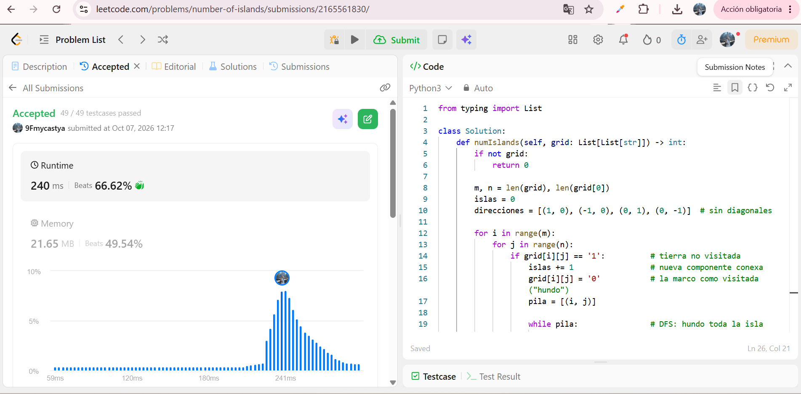
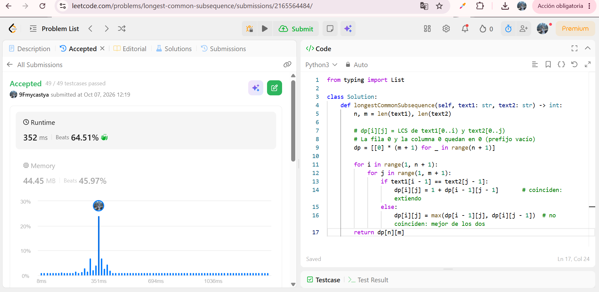
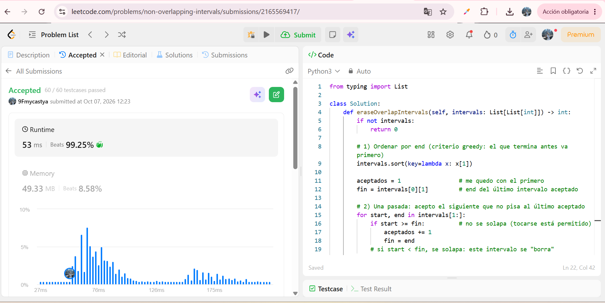
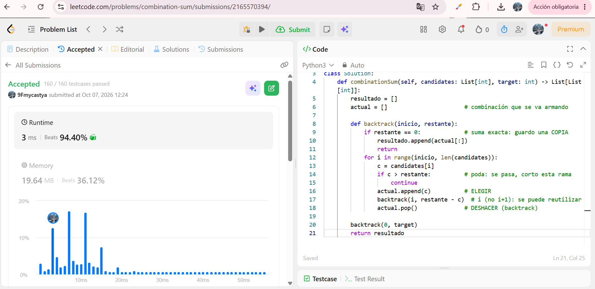

# Taller · Cinco familias en LeetCode

**Curso:** Análisis de algoritmos · ITM · 2026-2

Resolví cinco problemas Medium de LeetCode, uno por familia de algoritmos: ordenamiento, grafos, programación dinámica, greedy y backtracking. Todos en Python 3.

| # | Problema | Familia |
| --- | --- | --- |
| 1 | [56. Merge Intervals](#56-merge-intervals) | Ordenamiento |
| 2 | [200. Number of Islands](#200-number-of-islands) | Grafos |
| 3 | [1143. Longest Common Subsequence](#1143-longest-common-subsequence) | Programación dinámica |
| 4 | [435. Non-overlapping Intervals](#435-non-overlapping-intervals) | Greedy |
| 5 | [39. Combination Sum](#39-combination-sum) | Backtracking |

---

## 56. Merge Intervals

- Problema: https://leetcode.com/problems/merge-intervals/
- Submission aceptado: https://leetcode.com/problems/merge-intervals/submissions/2165545959/
- Código: [merge-intervals/solution.py](merge-intervals/solution.py)

**Familia:** ordenamiento

**Idea:** Implementé merge sort sobre los intervalos usando el `start` como clave. Luego recorro de izquierda a derecha manteniendo un intervalo "actual": si el siguiente empieza antes o justo cuando termina el actual, ensancho el `end` con `max`; si no, lo cierro y abro uno nuevo.

**Complejidad:**
- Tiempo: O(n log n), con n = número de intervalos (domina el sort; la fusión es O(n)).
- Espacio: O(n) para la lista de salida y los arreglos auxiliares del merge sort.

---

## 200. Number of Islands

- Problema: https://leetcode.com/problems/number-of-islands/
- Submission aceptado: https://leetcode.com/problems/number-of-islands/submissions/2165561830/
- Código: [number-of-islands/solution.py](number-of-islands/solution.py)

**Familia:** grafos

**Idea:** Modelo la grilla como un grafo no dirigido implícito: cada celda `'1'` es un vértice y hay arista con sus vecinas ortogonales (arriba, abajo, izquierda, derecha) que también son `'1'`, sin diagonales. Contar islas es contar componentes conexas. Recorro la grilla y, cada vez que encuentro un `'1'` sin visitar, sumo 1 y hago un DFS iterativo con pila que marca ("hunde") toda la isla.

**Complejidad:**
- Tiempo: Θ(m·n), con m filas y n columnas (cada celda se visita una vez).
- Espacio: O(m·n) en el peor caso, por la pila del DFS.

---

## 1143. Longest Common Subsequence

- Problema: https://leetcode.com/problems/longest-common-subsequence/
- Submission aceptado: https://leetcode.com/problems/longest-common-subsequence/submissions/2165564484/
- Código: [longest-common-subsequence/solution.py](longest-common-subsequence/solution.py)

**Familia:** programación dinámica

**Idea:**
- Estado: `dp[i][j]` = longitud de la LCS de `text1[0..i)` y `text2[0..j)`.
- Base: `dp[0][j] = dp[i][0] = 0` (un prefijo vacío no tiene nada en común).
- Recurrencia: si `text1[i-1] == text2[j-1]`, `dp[i][j] = 1 + dp[i-1][j-1]`; si no, `dp[i][j] = max(dp[i-1][j], dp[i][j-1])`.
- La respuesta es `dp[n][m]`.

**Complejidad:**
- Tiempo: Θ(n·m), con n = len(text1) y m = len(text2).
- Espacio: Θ(n·m) por la tabla completa (se podría reducir a Θ(min(n, m)) con dos filas).

---

## 435. Non-overlapping Intervals

- Problema: https://leetcode.com/problems/non-overlapping-intervals/
- Submission aceptado: https://leetcode.com/problems/non-overlapping-intervals/submissions/2165569417/
- Código: [non-overlapping-intervals/solution.py](non-overlapping-intervals/solution.py)

**Familia:** greedy

**Idea:** Es la selección de actividades contada al revés. Ordeno los intervalos por `end` y, en cada paso, acepto el siguiente que no pisa al último aceptado (`start >= end` del último), es decir, el que termina antes entre los que aún caben. Los que no se aceptan son los que se borran: respuesta = n − aceptados.

**Complejidad:**
- Tiempo: O(n log n), con n = número de intervalos (domina el sort; la pasada es O(n)).
- Espacio: O(1) extra, más lo que use el sort de la librería.

---

## 39. Combination Sum

- Problema: https://leetcode.com/problems/combination-sum/
- Submission aceptado: https://leetcode.com/problems/combination-sum/submissions/2165570394/
- Código: [combination-sum/solution.py](combination-sum/solution.py)

**Familia:** backtracking

**Idea:** Construyo las combinaciones paso a paso. En cada llamada elijo `candidates[i]` (con `i >= inicio` para no repetir permutaciones) y bajo con el mismo `i`, porque cada número se puede reutilizar. Si el restante llega a 0, guardo una copia de la combinación; si el candidato se pasa del restante, corto esa rama (poda). Al regresar, deshago la elección con `pop()` para probar el siguiente candidato.

**Complejidad:**
- Tiempo: O(n^(t/m)), con n = len(candidates), t = target y m = el candidato más pequeño (cota exponencial; la poda la reduce).
- Espacio: O(t/m) de pila de recursión, más la salida.

